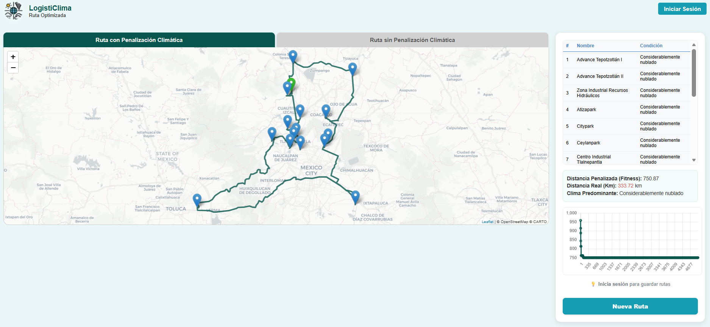

# LogistiClima - Trabajo Terminal

## Descripción del Proyecto

**LogistiClima** es un sistema de optimización de rutas logísticas que integra predicciones climáticas para mejorar la planificación de entregas a naves industriales. El proyecto utiliza algoritmos bioinspirados combinados con modelos de Machine Learning para predicción meteorológica.

---

## Estructura del Proyecto

```
TT/
├── README.md                    # Este archivo
├── documentacion/               # Documentación del proyecto
│   ├── TT_Documentacion.pdf     # Documento técnico completo
│   └── TT_Presentacion.pdf      # Diapositivas resumen del proyecto
├── TT1/                         # Fase 1: Investigación y desarrollo de algoritmos
└── TT2/                         # Fase 2: Implementación del sistema completo
```

---

## TT1 - Desarrollo e Investigación

**Objetivo:** Desarrollo, implementación y comparación de algoritmos bioinspirados y modelos de ML.

### Contenido:
| Carpeta | Descripción |
|---------|-------------|
| `data/` | Datos procesados (matrices de distancias) |
| `lib/` | Librerías compiladas (.dll/.so) |
| `notebooks/` | Experimentación con APIs meteorológicas y modelos de ML |
| `src/c/` | Implementaciones en C de algoritmos: Genético, PSO, Recocido Simulado, Búsqueda Tabú |
| `src/python/` | Wrappers en Python y scripts de comparación/benchmarking |

### Algoritmos Implementados:
- **Algoritmo Genético (GA)**
- **Optimización por Enjambre de Partículas (PSO)**
- **Recocido Simulado (Simulated Annealing)**
- **Búsqueda Tabú**

### Modelos de ML Evaluados:
- **Árbol de Decisión**
- **Random Forest**
- **SVM**
- **LSTM**
- **RNN**

---

## TT2 - Sistema Completo

**Objetivo:** Implementación del prototipo funcional y despliegue del sistema.

### Prototipo Local (`Prototipo_Local/`)
Núcleo computacional del sistema que incluye:

| Carpeta | Descripción |
|---------|-------------|
| `data/` | Datos crudos y procesados (naves industriales, matrices de distancias) |
| `database/` | Scripts SQL para la base de datos |
| `lib/` | Librerías compiladas (.dll/.so) |
| `models/` | Modelos de ML entrenados |
| `notebooks/` | Preprocesamiento de datos (municipios, naves) |
| `src/` | Código fuente (API, algoritmos en C, scripts Python) |
| `output/` | Resultados de rutas optimizadas |

### Prototipo Desplegado (`Prototipo_Final_Deployed/`)
Aplicación web lista para producción:

| Carpeta | Descripción |
|---------|-------------|
| `app/` | Aplicación principal (FastAPI/Flask) |
| `config/` | Configuración de parámetros del algoritmo |
| `data/` | Datos de naves industriales y distancias |
| `lib/` | Librerías compiladas (.dll/.so) |
| `static/` | Recursos web (CSS, JS, imágenes, animaciones) |
| `templates/` | Plantillas HTML de la interfaz |

### Funcionalidades del Sistema:
- Optimización de rutas con Recocido Simulado
- Predicciones climáticas en tiempo real
- Visualización geográfica de rutas
- Sistema de autenticación (registro/login)
- Historial de rutas por usuario
- Panel de administración

---

## Capturas del Sistema

### Visualización de Ruta Optimizada



*Vista del sistema mostrando: mapa con la ruta generada, tabla de naves a visitar, distancia total en kilómetros, clima predominante en la ruta, valor de fitness del algoritmo y gráfica de convergencia.*

---

## Tecnologías Utilizadas

| Categoría | Tecnologías |
|-----------|-------------|
| **Backend** | Python, C, FastAPI/Flask |
| **Frontend** | HTML, CSS, JavaScript |
| **ML/Data** | scikit-learn, TensorFlow/Keras, Pandas, NumPy |
| **APIs** | WeatherAPI, OpenRouteService |
| **Base de Datos** | MySQL (Cloud SQL) |
| **Despliegue** | Docker, Google Cloud Platform |

---

## Documentación

La documentación completa del proyecto se encuentra en la carpeta `documentacion/`:

- **[TT_Documentacion.pdf](documentacion/TT_Documentacion.pdf)** - Documento técnico completo con metodología, desarrollo e implementación
- **[TT_Presentacion.pdf](documentacion/TT_Presentacion.pdf)** - Diapositivas con resumen del proyecto

---

## Autores

- **Flores Lara Alberto**
- **Padilla Rodríguez Ethel**
- **Franco Calderas Sergio Alberto**

*Trabajo Terminal - ESCOM IPN*

---

## Licencia

Este proyecto fue desarrollado como parte del Trabajo Terminal en la Escuela Superior de Cómputo (ESCOM) del Instituto Politécnico Nacional (IPN).
