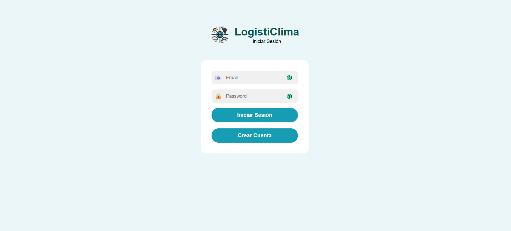
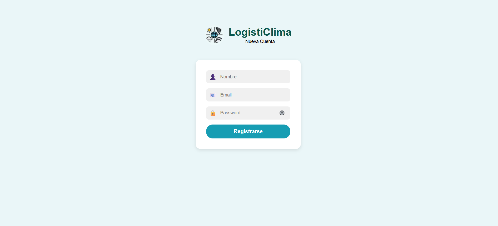
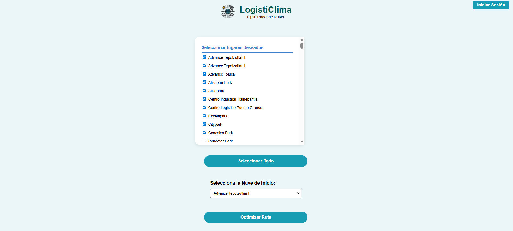
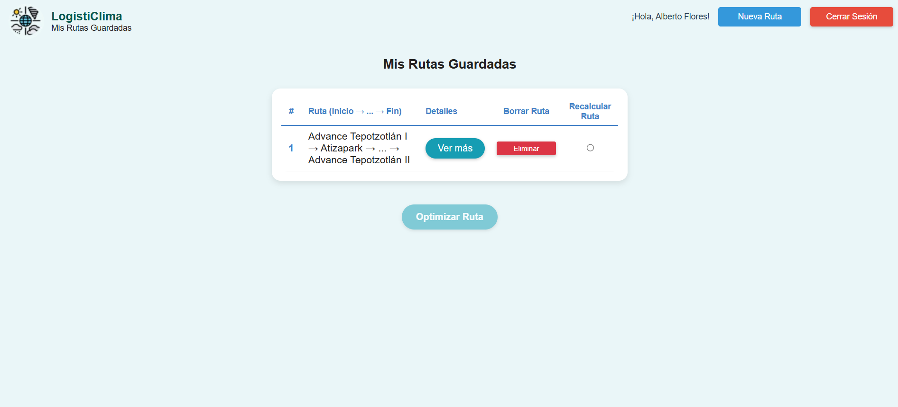
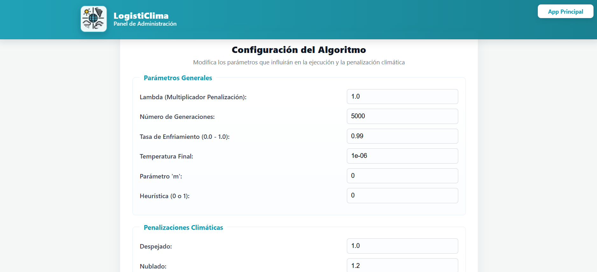

# LogistiClima - Sistema de optimización de rutas logísticas

## Descripción
Sistema web que integra predicciones climáticas para optimizar rutas de entrega a naves industriales usando el algoritmo de Recocido Simulado.

## Características
- **Optimización de rutas** con algoritmo de recocido simulado
- **Predicciones climáticas** en tiempo real usando machine learning
- **Visualización geográfica** de rutas optimizadas
- **Interfaz web** para selección de destinos y visualización de resultados
- **Panel de administración** para configurar parámetros del algoritmo
- **Sistema de autenticación** con registro e inicio de sesión
- **Historial de rutas** guardadas por usuario

## Instalación

### Requisitos
- Python 3.9+
- Docker (para despliegue en producción)
- Base de datos MySQL (Cloud SQL en producción)

### Variables de entorno requeridas
```
SECRET_KEY=clave_secreta_para_sesiones
DB_USER=usuario_base_datos
DB_PASS=contraseña_base_datos
DB_NAME=nombre_base_datos
DB_HOST=/cloudsql/proyecto:region:instancia
WEATHER_API_KEY=api_key_weatherapi
```

### Configuración de la base de datos

El archivo `database/BDD.sql` contiene el script para crear la base de datos y las tablas necesarias. (Es necesario modificar las lineas de código con el nombre de la base de datos según sea necesario, por default es "nombre_base_datos")

**Ejecutar el script SQL:**
```bash
mysql -u root -p < database/BDD.sql
```

**Estructura de la base de datos:**
- **nombre_base_datos** - Nombre de la base de datos
  - **Usuario** - Almacena usuarios registrados (id, nombre, correo, contraseña_hash)
  - **Ruta** - Almacena rutas guardadas por usuario (id, id_usuario, destinos en JSON)

### Pasos de instalación local

1. **Clonar el repositorio principal**:
```bash
git clone https://github.com/FosterTooth1/TT.git
cd TT2\Prototipo_Final_Deployed
```

2. **Instalar dependencias:**
```bash
pip install -r requirements.txt
```

3. **Ejecutar el servidor:**
```bash
python app/main.py
```

4. **Abrir en el navegador:**
   - URL: `http://localhost:5000`

### Despliegue con Docker

1. **Construir imagen:**
```bash
docker build -t logisticlima .
```

2. **Ejecutar contenedor:**
```bash
docker run -p 8080:8080 logisticlima
```

## Uso

### Flujo principal
1. **Seleccionar naves**: Elige al menos 5 naves industriales de la lista
2. **Seleccionar inicio**: Indica desde qué nave comenzar la ruta
3. **Generar ruta**: El sistema calcula la ruta optimizada considerando condiciones climáticas
4. **Visualizar resultado**: Ve la ruta en el mapa interactivo con comparativa de rutas con penalizaciones y sin penalizaciones
5. **Guardar Ruta**: Los usuarios autenticados pueden guardar sus rutas

### Funcionalidades
- **Selección de destinos**: Checkbox para elegir naves industriales
- **Optimización de rutas**: Considera distancias reales y penalizaciones climáticas
- **Comparativa de rutas**: Muestra ruta con y sin penalización climática
- **Visualización en mapa**: Marcadores y ruta optimizada usando Leaflet
- **Información detallada**: Tabla con orden de visita y condiciones climáticas
- **Gráfica de convergencia**: Muestra la evolución del fitness durante la optimización

## Estructura del proyecto

```
├── app/
│   ├── main.py                     # Servidor Flask y lógica principal
│   └── prediccion_clima.pkl        # Modelo de ML entrenado
├── config/
│   └── parametros.json             # Parámetros del algoritmo
├── data/
│   ├── Naves_Industriales.csv      # Base de datos de naves
│   └── Matriz_Distancias_Carretera.csv  # Matriz de distancias
├── database/
│   └── BDD.sql                     # Script SQL para crear la base de datos
├── lib/
│   ├── recocido.dll                # Biblioteca C++ (Windows)
│   └── librecocido.so              # Biblioteca C++ (Linux)
├── static/
│   ├── animations/                 # Animaciones Lottie
│   ├── css/                        # Estilos CSS
│   │   ├── estilo_auth.css
│   │   ├── estilo_IniciarSesion.css
│   │   ├── estilo_MejorRuta.css
│   │   ├── estilo_NuevaCuenta.css
│   │   ├── estilo_RutasRecientes.css
│   │   └── estilo_SeleccionarNaves.css
│   ├── images/                     # Imágenes
│   │   └── logo.jpg
│   │   ├── marker-icon-2x-green.png
│   │   └── marker-shadow.png
│   └── js/                         # JavaScript
│       ├── js_IniciarSesion.js
│       ├── js_MejorRuta.js
│       ├── js_NuevaCuenta.js
│       ├── js_RutasRecientes.js
│       └── js_SeleccionarNaves.js
├── templates/                      # Plantillas HTML
│   ├── IniciarSesion.html          # Inicio de sesión
│   ├── MejorRuta.html              # Visualización de resultados
│   ├── NuevaCuenta.html            # Registro de usuarios
│   ├── panel_admin.html            # Panel de administración
│   ├── RutasRecientes.html         # Historial de rutas
│   └── SeleccionarNaves.html       # Selección de destinos
├── Dockerfile                      # Configuración Docker
├── requirements.txt                # Dependencias Python
└── README.md                       # Este archivo
```

## APIs disponibles

### Públicas
- `GET /api/naves` - Obtener lista de naves industriales
- `POST /api/generar-ruta` - Generar ruta optimizada
  - Body: `{"indices": [0, 1, 2, ...], "indice_inicio": 0}`
  - Response: Rutas optimizadas con y sin penalización climática

### Autenticación
- `POST /registrar_usuario` - Registrar nuevo usuario
- `POST /login_usuario` - Iniciar sesión
- `POST /cerrar-sesion` - Cerrar sesión

### Rutas (requiere autenticación)
- `GET /obtener_rutas` - Obtener rutas guardadas del usuario
- `POST /guardar-ruta` - Guardar una ruta
- `DELETE /eliminar-ruta/<id>` - Eliminar una ruta
- `GET /regenerar-ruta/<id>` - Regenerar una ruta guardada

### Administración (requiere rol admin)
- `GET /panel_admin` - Panel de configuración
- `POST /actualizar_parametros` - Actualizar parámetros del algoritmo

## Capturas de pantalla

### Inicio de sesión

*Pantalla de inicio de sesión para usuarios registrados.*

### Registro de usuario

*Formulario de registro para nuevos usuarios.*

### Selección de naves industriales

*Interfaz para seleccionar las naves industriales a visitar y la nave industrial de inicio.*

### Visualización de ruta optimizada

*Vista principal mostrando: mapa con la ruta generada, tabla de naves a visitar, distancia total en km, fitness del algoritmo y gráfica de convergencia.*

### Historial de rutas

*Historial de rutas guardadas por el usuario las cuales puede reoptimizar, eliminar o ver detalladamente.*

### Panel de administración

*Panel para configurar los parámetros del algoritmo de optimización y las penalizaciones climáticas.*

---

## Tecnologías utilizadas

- **Backend**: Python 3.9, Flask, Gunicorn, Pandas, NumPy
- **Base de datos**: MySQL (Cloud SQL)
- **Algoritmo**: Recocido simulado (implementado en C)
- **Machine learning**: Random forest para predicciones climáticas
- **APIs externas**: WeatherAPI para datos climáticos en tiempo real
- **Frontend**: HTML5, CSS3, JavaScript
- **Contenedores**: Docker
- **Despliegue**: Google Cloud Run

## Notas de desarrollo

- El sistema requiere conexión a internet para la API de clima
- Las predicciones climáticas se realizan en paralelo para mejor rendimiento
- El algoritmo de optimización usa la biblioteca C++ para mayor velocidad
- La base de datos de naves industriales está enfocada en el Estado de México
- Los parámetros del algoritmo son configurables desde el panel de administración
